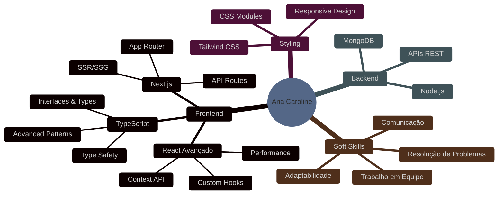

<div align="center">


[](https://git.io/typing-svg)

</div>

##


### 👋 Sobre mim

🎓 **Graduanda** em Análise e Desenvolvimento de Sistemas  
💼 **Estagiária Frontend** na Codie  
📍 **Londrina, Paraná**  
💡 **Paixão**: Criar soluções digitais que unem funcionalidade e design  
🎯 **Foco atual**: Desenvolvimento com TypeScript, React e Next.js

```typescript
const anaCaroline = {
  code: ["TypeScript", "JavaScript", "HTML", "CSS"],
  technologies: {
    frontEnd: {
      js: ["React", "React Hooks", "Next.js"],
      ts: ["TypeScript"],
      css: ["Tailwind CSS", "Styled Components", "CSS3"]
    },
    backEnd: {
      js: ["Node.js"],
      databases: ["JSON Server", "MongoDB"]
    },
    tools: ["Git", "GitHub", "VS Code", "Figma", "NPM/Yarn"]
  },
  currentFocus: "Desenvolvimento com TypeScript e React",
  workingOn: ["E-commerce platforms", "Landing pages", "Web applications"],
  learningNext: ["Advanced TypeScript patterns", "Testing (Jest/RTL)", "CI/CD"]
};
```

<br clear="right"/>

##

### 🚀 Linguagens e Tecnologias

<div align="center">


</div>

##

### 📊 Estatísticas do GitHub

<div align="center">
  
| 📊 GitHub Stats | 🗣️ Linguagens Mais Usadas |
|:---:|:---:|
|  |  |

</div>

<div align="center">
  
**Total de Commits: 38** • **Current Streak: 1 dia** • **Longest Streak: 5 dias**

[](https://git.io/streak-stats)

</div>

##

### 📈 Atividade de Contribuições

<div align="center">

**51 contribuições totais** | Trabalhando em projetos da **Codie** e **CodieDigital**

</div>

<details>
<summary>📅 <b>Janeiro 2026</b> - 15 commits em 2 repositórios</summary>
<br>


</details>

<details>
<summary>📅 <b>Dezembro 2025</b> - 18 commits em 5 repositórios</summary>
<br>


</details>

##

### 🎯 Aprendizado Contínuo

<div align="center">



</div>

##

### 📈 Gráfico de Contribuições

<div align="center">


<br>

**Total de contribuições em 2025: 75+**


</div>

##

### 📫 Vamos nos conectar?

<div align="center">

[](https://linkedin.com/in/ana-caroline-alves-65403a218)
[](https://github.com/AgaraCarol)

</div>

##

<div align="center">

### 💭 Citação


</div>

##


<div align="center">


<br>


</div>

##

<div align="center">

### ✨ *"Da análise laboratorial aos algoritmos - sempre em busca de precisão e excelência."*


</div>


