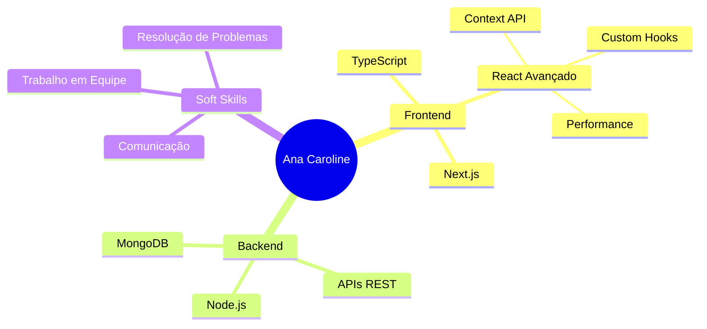

<div align="center">


[](https://git.io/typing-svg)

</div>

##


### 👋 Sobre mim

🎓 **Graduanda** em Análise e Desenvolvimento de Sistemas  
💼 **Estagiária Frontend** na Codie  
📍 **Londrina, Paraná**  
🔬 **Background**: Técnica em Análises Clínicas  
💡 **Paixão**: Criar soluções digitais que unem funcionalidade e design

```javascript
const anaCaroline = {
  code: ["JavaScript", "TypeScript", "HTML", "CSS"],
  technologies: {
    frontEnd: {
      js: ["React", "React Hooks"],
      css: ["Tailwind", "Styled Components"]
    },
    backEnd: {
      js: ["Node.js"],
      databases: ["JSON Server", "MongoDB"]
    },
    tools: ["Git", "GitHub", "VS Code", "Figma"]
  },
  currentFocus: "Aprofundamento em React e seu ecossistema",
  learningNext: ["Next.js", "TypeScript", "Redux"]
};
```

<br clear="right"/>

##

### 🚀 Linguagens e Tecnologias

<div align="center">


</div>

##

### 💼 Projetos em Destaque

<div align="center">

<table>
<tr>
<td width="50%">

<h3 align="center">HTTP React - Sistema CRUD</h3>

<div align="center">  
<a href="https://agaracarol.github.io/httpreact" target="_blank"></a>
<a href="https://github.com/AgaraCarol/httpreact" target="_blank"></a>
  
<p><strong>React, JavaScript ES6+, JSON Server</strong></p>

<p>Aplicação web moderna para gerenciamento completo de produtos com operações CRUD. Interface responsiva com animações fluidas e Custom Hooks para requisições HTTP.</p>

</div>

</td>
<td width="50%">

<h3 align="center">Jogo de Palavras Secretas</h3>

<div align="center">
<a href="https://agaracarol.github.io/secret-word-game/" target="_blank"></a>
<a href="https://github.com/AgaraCarol/secret-word-game" target="_blank"></a>

<p><strong>React, JavaScript ES6+, React Hooks</strong></p>

<p>Jogo interativo desenvolvido para prática de lógica. Sistema de pontuação dinâmica, gerenciamento de estado complexo com múltiplas fases e validações em tempo real.</p>

</div>

</td>
</tr>
</table>

</div>

##

### 📊 Estatísticas do GitHub

<div align="center">
  
  
</div>

<div align="center">
  
</div>

<div align="center">
  
</div>

##

### 🎯 Aprendizado Contínuo

<div align="center">


```mermaid
mindmap
  root((Ana Caroline))
    Frontend
      React Avançado
        Custom Hooks
        Context API
        Performance
      Next.js
      TypeScript
    Backend
      Node.js
      APIs REST
      MongoDB
    Soft Skills
      Trabalho em Equipe
      Comunicação
      Resolução de Problemas
```

</div>

##

### 📫 Vamos nos conectar?

<div align="center">

[](https://linkedin.com/in/ana-caroline-alves-65403a218)
[](mailto:anacarolinedacruzalves@gmail.com)
[](https://github.com/AgaraCarol)

</div>

##

<div align="center">

### 💭 Citação


</div>

##

<div align="center">
  
### 🏆 Conquistas


</div>

##

<div align="center">


<br>


</div>

##

<div align="center">

### ✨ *"Da análise laboratorial aos algoritmos - sempre em busca de precisão e excelência."*


</div>
